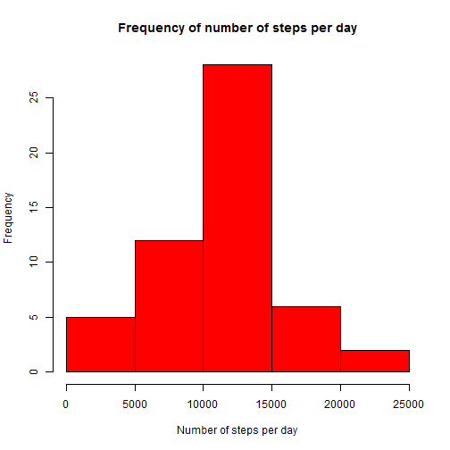
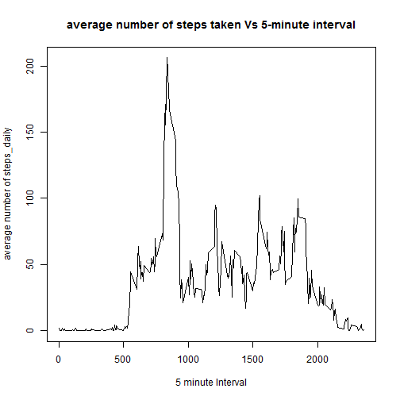
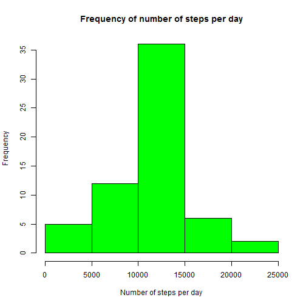
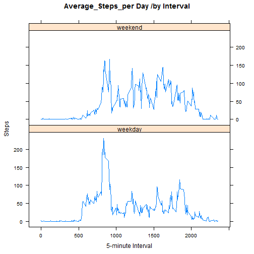

## Loading and preprocessing the data

1. Load the data (i.e. read.csv())


```r
zipFile <- "activity.zip"
csvFile <- "activity.csv"
initial <- read.csv(unz(zipFile, csvFile), nrows = 17568)
colClasses <- sapply(initial, class)
theData <- read.csv(unz(zipFile, csvFile), header = TRUE, sep = ",",
                    na.strings = "NA", colClasses = colClasses)
```

2.Process/transform the data (if necessary) into a format suitable for your analysis
   

```r
theData_completeCases <- na.omit(theData)
nrow(theData_completeCases) #number of rows after removing 
```

```
## [1] 15264
```

```r
                            #the missing values, keeping the 'complete cases' only
```
   
  
## What is mean total number of steps taken per day?

1.Calculate the total number of steps taken per day


```r
steps_per_day <- tapply(theData_completeCases$steps, theData_completeCases$date, sum)
```

2.Make a histogram of the total number of steps taken each day


```r
hist(steps_per_day, main = "Frequency of number of steps per day",
     xlab = "Number of steps per day", ylab = "Frequency", col ="red")
```

 

3.Calculate and report the mean and median of the total number of steps taken per day


```r
meaN <- mean(steps_per_day, na.rm= T)
med <- median(steps_per_day, na.rm = T)
```

**REPORT :** 
  The  mean of the total number of steps taken per day is : 1.0766189 &times; 10<sup>4</sup>
  The meadian of the total number of steps taken per day is : 10765
  
## What is the average daily activity pattern?

1.Make a time series plot (i.e. type = "l") of the 5-minute interval (x-axis)
and the average number of steps taken, averaged across all days (y-axis)


```r
stepsMean_per_interval<-aggregate(steps~interval,theData_completeCases,mean,na.rm=TRUE)
plot(stepsMean_per_interval, type = "l", main = "average number of steps taken Vs 5-minute interval",
     xlab="5 minute Interval",ylab = "average number of steps_daily" )
```

 

2.Which 5-minute interval, on average across all the days in the dataset,
  contains the maximum number of steps?


```r
inter <- stepsMean_per_interval[which.max(stepsMean_per_interval$steps),1]
stps <- stepsMean_per_interval[which.max(stepsMean_per_interval$steps),2]
```

5-minute interval 835, contains the maximum number of steps( 206.1698113)


## Imputing missing values

1.Calculate and report the total number of missing values in the dataset
(i.e. the total number of rows with NAs)

```r
   missingValues <- sum(is.na(theData))
```

There are 2304 in the dataset.

2.Devise a strategy for filling in all of the missing values in the dataset.
The strategy does not need to be sophisticated. For example,
you could use the mean/median for that day, or the mean for that 5-minute interval, etc.


```r
fill.value <- function(steps, interval) {
  filled <- NA
  if (!is.na(steps)) 
    filled <- c(steps) 
  else filled <- (stepsMean_per_interval[stepsMean_per_interval$interval == interval, "steps"])
  return(filled)
}
```

3.Create a new dataset that is equal to the original dataset but with the missing data filled in.


```r
filled.theData <- theData # using the divised strategy above.
```

4.Make a histogram of the total number of steps taken each day and Calculate 
and report the mean and median total number of steps taken per day. Do these 
values differ from the estimates from the first part of the assignment? 
What is the impact of imputing missing data on the estimates of the total daily number of steps?


```r
filled.theData$steps <- mapply(fill.value, filled.theData$steps, filled.theData$interval)
steps_per_day2 <- tapply(filled.theData$steps, filled.theData$date, sum)
hist(steps_per_day2, main = "Frequency of number of steps per day",
     xlab = "Number of steps per day", ylab = "Frequency", col ="green")
```

 

```r
meaN2 <- mean(steps_per_day2)
med2 <- median(steps_per_day2)
```

**REPORT :** 
  mean of the total number of steps taken per day : 1.0766189 &times; 10<sup>4</sup>
  median of the total number of steps taken per day : 1.0766189 &times; 10<sup>4</sup>
  
These values slightly differ from the estimates from the first
part of the assignment : the mean value is the same as the previous value
from the previous estimates(before any values were imputed to fill in  for the NAs);
the median value has changed and is (coincidantly) the same as the mean's.
  
## Are there differences in activity patterns between weekdays and weekends?

1.Create a new factor variable in the dataset with two levels - "weekday" and "weekend" 
indicating whether a given date is a weekday or weekend day.


```r
weekday.or.weekend <- function(date) {
  day <- weekdays(date)
  if (day %in% c("Monday", "Tuesday", "Wednesday", "Thursday", "Friday")) 
    return("weekday") else if (day %in% c("Saturday", "Sunday")) 
      return("weekend") else stop("invalid date")
}
filled.theData$date <- as.Date(filled.theData$date)
filled.theData$day <- sapply(filled.theData$date, weekday.or.weekend)
```

2.Make a panel plot containing a time series plot (i.e. type = "l") of
the 5-minute interval (x-axis) and the average number of steps taken, 
averaged across all weekday days or weekend days (y-axis). See the README
file in the GitHub repository to see an example of what this plot should look
like using simulated data.


```r
install.packages("lattice", repos="http://cran.rstudio.com/")
```

```
## Error in install.packages : Updating loaded packages
```

```r
library(lattice)
stepsMean_per_interval2 <- aggregate(steps~interval + day,filled.theData, mean)
xyplot(stepsMean_per_interval2$steps ~ stepsMean_per_interval2$interval|stepsMean_per_interval2$day,
       main="Average_Steps_per Day /by Interval",xlab="5-minute Interval", ylab="Steps",layout=c(1,2), type="l")
```

 
